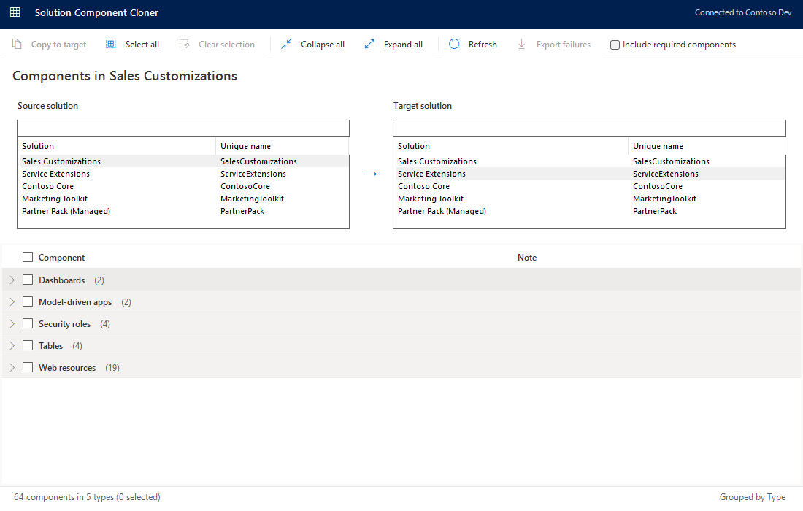
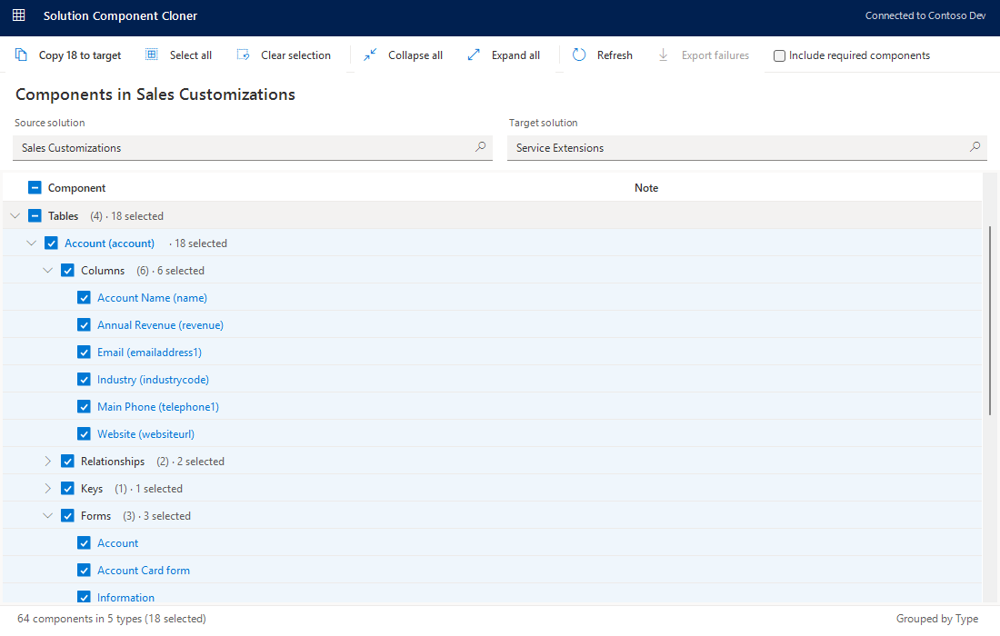
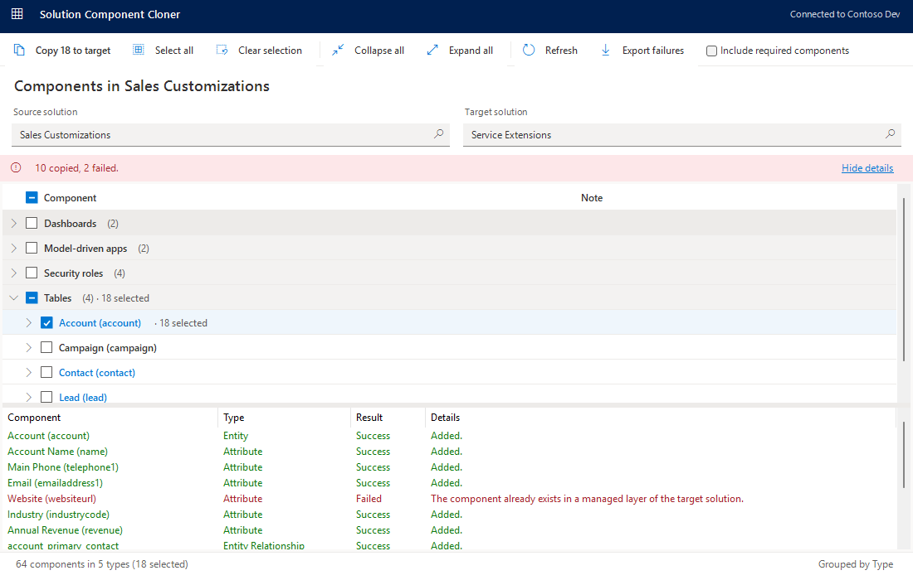

# Solution Component Cloner

An [XrmToolBox](https://www.xrmtoolbox.com/) tool that copies components from one Dataverse / Dynamics 365
solution into another, browsing the source solution the way the Power Apps solution explorer does.

## Features

- **Solution explorer tree** – the source solution's components are grouped by type. Tables hold their
  columns, relationships, keys, forms, views, charts, dashboards and business rules, and web resources are
  split into Code, Data and Images. Folders show counts, such as "Web resources (19)".
- **Select exactly what you need** – every folder has a tri-state checkbox, so one click selects everything
  inside it. Select all, Clear selection, and Expand / Collapse all are one click away. Large solutions open
  collapsed so every type fits on one screen.
- **Include required components** – optionally add each component's dependencies too (the same behaviour as
  `AddRequiredComponents` on `AddSolutionComponentRequest`), or copy only what you ticked.
- **Safe copying** – only unmanaged solutions are accepted as a target. Tables are copied before their
  columns, forms and views, and Model-driven apps carry a warning because they always pull in everything
  they are built from.
- **Clear results** – a banner summarises how many components were copied or failed, with a per-component
  list one click away. Failures can be exported to CSV.
- **Readable names everywhere** – including custom and ISV component types, which are resolved through
  `solutioncomponentdefinition`. Solutions and components with thousands of rows are loaded in full.

## Screenshots

**Browse the tree and tick what to copy**

**Review the results**

## Install

- From the XrmToolBox Tool Library: search for **Solution Component Cloner**.
- Or download the latest DLL from the [Releases](https://github.com/abdelkayoumd/SolutionComponentCloner/releases)
  page and copy it into XrmToolBox's `Plugins` folder.

## License

[MIT](LICENSE) © 2026 abdelkayoumd
